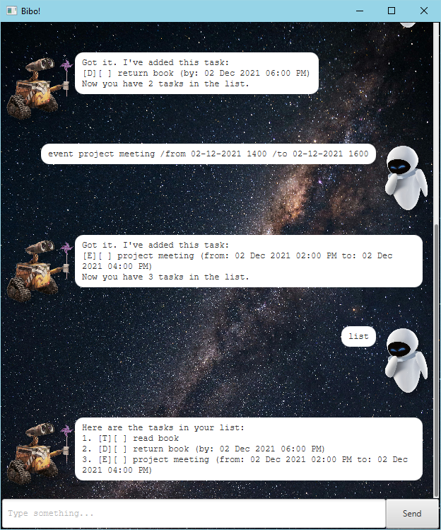
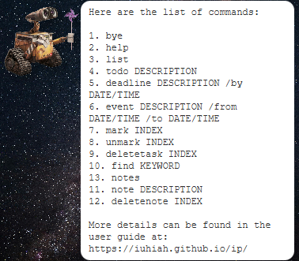

# Bibo User Guide



> "Beep boop... Beeboo... Bibo?" - Bibo, probably

Installation guide:

1. Download Bibo from [here](https://github.com/iuhiah/ip/releases/download/v1.0.0/bibo-1.0.0.jar)
2. Follow the installation instructions [here](https://github.com/iuhiah/ip?tab=readme-ov-file#installation)

## Commands
Be sure to follow the format specified in the user guide for the commands to work properly. Arguments in UPPER_CASE are to be replaced with user input.

### General Commands

* `bye`: Exits the program.

Example usage: `bye`

Expected output:

```
Goodbye! Hope to see you again soon!
```
The program will exit shortly after.

* `help`: Lists all available commands.

Example usage: `help`

Expected output:



### Task Management Commands

* `list`: Lists all tasks in the task list.

Expected output after running `list` after adding a todo task with the description "read book":

```
Here are the tasks in your list:
1. [T][ ] read book
```

* `find KEYWORD`: Lists all tasks with the given keyword in the description.

Expected output after running `find book`:

```
Here are the matching tasks in your list:
1. [T][ ] read book
```

Tasks will persist across sessions. The command line interface will display status of loading tasks from a previous session.

Expected output loading tasks from a previous session:

```
Checking for saved data...
Saved data found. Loading data from file...
Successfully loaded 3 of 3 tasks.
File setup complete.
Task list loaded successfully.
```

Expected output if data is corrupted:

```
Checking for saved data...
Saved data found. Loading data from file...
Task format is invalid.
Successfully loaded 1 of 2 tasks.
Some data was corrupted, corrupted data file renamed to:
        data\tasks.txt.corrupted
File setup complete.
Task list loaded successfully.
```

#### Task Types

* `todo DESCRIPTION`: Adds a todo task with the given description.
* `deadline DESCRIPTION /by DATE/TIME`: Adds a deadline task with the given description and date.
* `event DESCRIPTION /from DATE/TIME /to DATE/TIME`: Adds an event task with the given description and date.

All date/time arguments must be in the format `dd-MM-yyyy HHmm` with time in 24-hour format.

e.g. `02-12-2021 1800` for 6:00 PM on 2 December 2021.

Duplicate tasks are not allowed.

Example commands:

* `todo read book`
* `deadline return book /by 02-12-2021 1800`
* `event project meeting /from 02-12-2021 1400 /to 02-12-2021 1600`

Expected output after running `todo read book`:

```
Got it. I've added this task:
[T][ ] read book
Now you have 1 task in the list.
```

#### Task Modification Commands

* `mark TASK_NUMBER`: Marks the task with the given task number as done.
* `unmark TASK_NUMBER` Marks the task with the given task number as not done.

Expected output after running `mark 1`:

```
Nice! I've marked this task as done:
[T][X] read book
```

* `deletetask TASK_NUMBER` Deletes the task with the given task number.

Expected output after running `deletetask 1`:

```
Noted. I've removed this task:
[T][X] read book
Now you have 0 tasks in the list.
```

### Notes Management Commands

* `notes`: Lists all notes in the notes list.

Expected output after running `notes` after adding a note with the description "read book":

```
Here are the notes in your list:
1. read book
```

* `note CONTENT`: Adds a note with the given content.
* `note TITLE /content CONTENT`: Adds a note with the given title and content.

Example of expected output after running `note read book`:

```
Got it. I've added this note:
read book
Now you have 1 note in the list.
```

Example of expected output after running `note my lunch /content very yummy scrap metal`:

```
Got it. I've added this note:
my lunch
very yummy scrap metal
Now you have 2 notes in the list.
```

* `deletenote NOTE_NUMBER`: Deletes the note with the given note number.

Example of expected output after running `deletenote 1`:

```
Noted. I've removed this note:
read book
Now you have 1 note in the list.
```

Notes do not persist across sessions. Duplicate notes are allowed.
